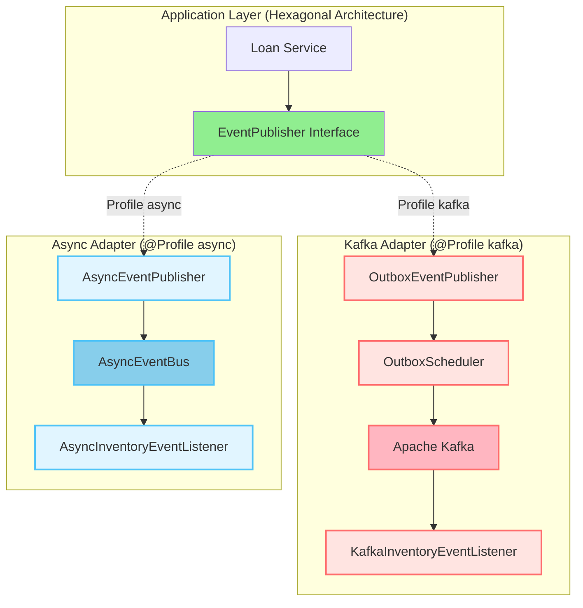
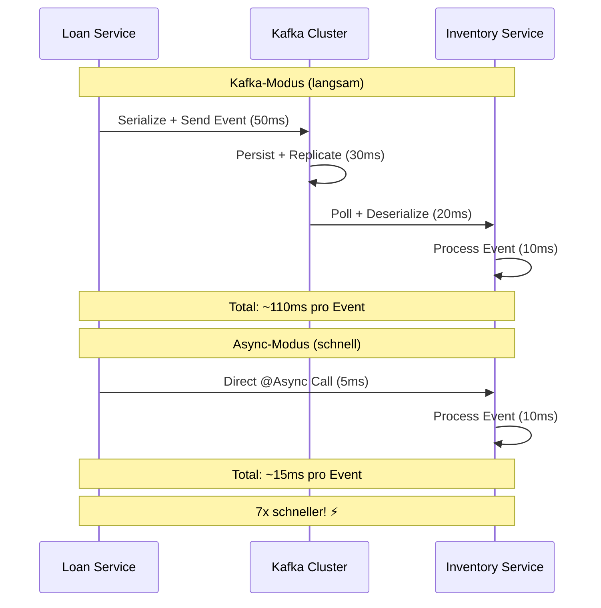

```mermaid
graph TB
    subgraph "Application Layer (Hexagonal Architecture)"
        APP[Loan Service]
        PORT[EventPublisher Interface]
    end
    
    subgraph "Kafka Adapter (@Profile kafka)"
        OUTBOX[OutboxEventPublisher]
        SCHEDULER[OutboxScheduler]
        KAFKA_LISTENER[KafkaInventoryEventListener]
        KAFKA[Apache Kafka]
    end
    
    subgraph "Async Adapter (@Profile async)"
        ASYNC_PUB[AsyncEventPublisher]
        BUS[AsyncEventBus]
        ASYNC_LISTENER[AsyncInventoryEventListener]
    end
    
    APP --> PORT
    PORT -.Profile kafka.-> OUTBOX
    PORT -.Profile async.-> ASYNC_PUB
    
    OUTBOX --> SCHEDULER
    SCHEDULER --> KAFKA
    KAFKA --> KAFKA_LISTENER
    
    ASYNC_PUB --> BUS
    BUS --> ASYNC_LISTENER
    
    style PORT fill:#90EE90
    style KAFKA fill:#FFB6C1
    style BUS fill:#87CEEB
    
    classDef kafkaStyle fill:#FFE4E1,stroke:#FF6B6B,stroke-width:2px
    classDef asyncStyle fill:#E1F5FF,stroke:#4FC3F7,stroke-width:2px
    
    class OUTBOX,SCHEDULER,KAFKA_LISTENER,KAFKA kafkaStyle
    class ASYNC_PUB,BUS,ASYNC_LISTENER asyncStyle
```

## Performance-Vergleich

```mermaid
sequenceDiagram
    participant App as Loan Service
    participant Kafka as Kafka Cluster
    participant Inventory as Inventory Service
    
    Note over App,Inventory: Kafka-Modus (langsam)
    App->>Kafka: Serialize + Send Event (50ms)
    Kafka->>Kafka: Persist + Replicate (30ms)
    Kafka->>Inventory: Poll + Deserialize (20ms)
    Inventory->>Inventory: Process Event (10ms)
    Note over App,Inventory: Total: ~110ms pro Event
    
    Note over App,Inventory: Async-Modus (schnell)
    App->>Inventory: Direct @Async Call (5ms)
    Inventory->>Inventory: Process Event (10ms)
    Note over App,Inventory: Total: ~15ms pro Event
    Note over App,Inventory: 7x schneller! ⚡
```
