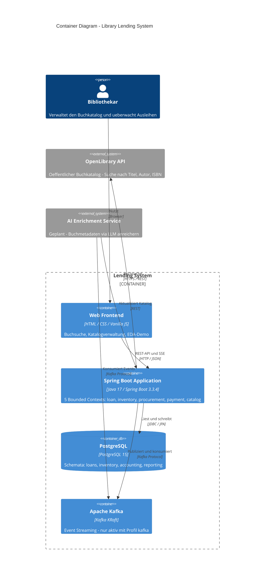

# C4 Container Diagram – Lending System

> **Level 2 – Container Diagram** nach dem [C4 Model](https://c4model.com).  
> Zeigt alle laufzeitrelevanten Bausteine des Systems und ihre Kommunikationswege.  
> Interne Struktur der Spring-Boot-Applikation → siehe [Bounded Context Map](./bounded-context-map.md) (geplant).

---



---

## Erläuterungen

### Web Frontend

Drei eigenständige statische HTML-Seiten, kein Framework, kein Build-Tool.
Spring Boot liefert sie über den eingebauten Ressourcen-Server aus (`/static/`).

| Seite | Pfad | Funktion |
|-------|------|---------|
| Landing Page | `/catalog/index.html` | Einstieg, Links zu Suche und Verwaltung |
| Buchsuche | `/catalog/search.html` | OpenLibrary-Suche, Detailansicht, Übernahme |
| Katalogverwaltung | `/catalog/manage.html` | Listet gespeicherte Bücher, Entfernen |
| EDA-Demo | `/demo/demo.html` | Visualisiert den Event-Driven Loan-Flow |

### Spring Boot Application

Ein einziger deployierbarer Prozess mit fünf Bounded Contexts nach Hexagonaler Architektur.

| Context | Kernaufgabe |
|---------|-------------|
| `loan` | Ausleihanfragen entgegennehmen, Zustandsmaschine |
| `inventory` | Buchexemplare reservieren und verwalten |
| `procurement` | Externe Beschaffung über OpenLibrary |
| `payment` | Gebührenerhebung (Grundgerüst) |
| `catalog` | Buchkatalog pflegen (Inkrement v1) |

### PostgreSQL

Hibernate DDL `create` – Schema wird beim Start neu erzeugt (kein Datenverlust-Schutz in v1).  
Liquibase ist vorbereitet, aber deaktiviert (`spring.liquibase.enabled: false`).

### Apache Kafka

Nur im Profil `kafka` aktiv. Im Standardprofil `async` werden Events über Spring `@Async`  
in-memory verarbeitet – kein Kafka-Prozess nötig.

### OpenLibrary API (extern)

Wird von zwei Adaptern genutzt:
- `OpenLibraryClientAdapter` (procurement) – ISBN-Suche für den Beschaffungsfluss
- `OpenLibraryCatalogAdapter` (catalog) – Freitextsuche für den Bibliothekskatalog

### AI Enrichment Service (geplant)

Separater Microservice – **nicht Teil des aktuellen Deployments**.  
Kommunikationsweg: konsumiert `catalog.book_registered.v1`-Events aus Kafka,  
ruft ein LLM auf, publiziert `catalog.book_enriched.v1` zurück.

---

## Deployment-Ansicht (lokal)

```
docker-compose up -d        → PostgreSQL (Port 5432) + Kafka (Port 9092)
mvn spring-boot:run         → Spring Boot App (Port 8080)
Browser                     → http://localhost:8080/catalog/index.html
```
