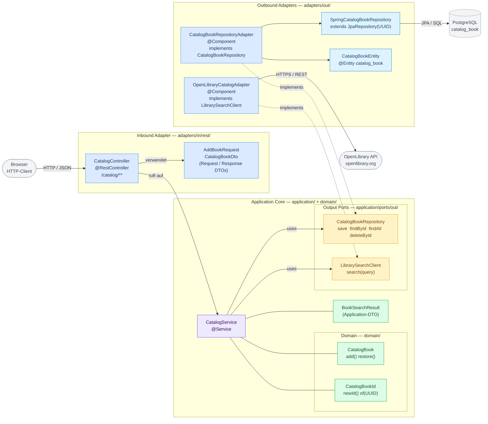

# Hexagonal Architecture – Catalog Context

> **Level 3 – Component Diagram** für den `catalog`-Bounded-Context.  
> Zeigt das Hexagonale Architekturmuster anhand der vollständig implementierten Klassen aus Inkrement v1.

---



---

## Architekturprinzipien im Diagramm

### Dependency Rule

Alle Pfeile zeigen **von außen nach innen** – die Domain-Objekte haben keine Abhängigkeit  
auf Adapter, Spring oder Datenbank. Einzige Ausnahme: die `-.->` (gestrichelte) Linie  
zeigt, dass der Adapter den Port *implementiert* (Dependency Inversion).

```
Browser → Adapter → Service → Domain
                 ↘           ↗
               Port (Interface)
                 ↗
            Adapter (implementiert Port, hängt davon ab)
```

### Farbkodierung

| Farbe | Bedeutung | Beispiele |
|-------|-----------|-----------|
| Blau | Adapter (Inbound + Outbound) | `CatalogController`, `CatalogBookRepositoryAdapter` |
| Lila | Application Service | `CatalogService` |
| Gelb | Output Ports (Interfaces) | `CatalogBookRepository`, `LibrarySearchClient` |
| Grün | Domain + Application-DTOs | `CatalogBook`, `CatalogBookId`, `BookSearchResult` |
| Hellblau | Infrastruktur-Klassen | `SpringCatalogBookRepository`, `CatalogBookEntity` |
| Grau | Externe Systeme | Browser, PostgreSQL, OpenLibrary API |

### Paketstruktur

```
de.demo.lending.catalog/
├── adapters/
│   ├── in/
│   │   └── rest/
│   │       ├── CatalogController.java          ← Blau (Inbound Adapter)
│   │       └── dto/
│   │           ├── AddBookRequest.java          ← Blau (DTO)
│   │           └── CatalogBookDto.java          ← Blau (DTO)
│   └── out/
│       ├── external/
│       │   └── OpenLibraryCatalogAdapter.java  ← Blau (Outbound Adapter)
│       └── persistence/
│           ├── CatalogBookRepositoryAdapter.java ← Blau (Outbound Adapter)
│           ├── CatalogBookEntity.java           ← Hellblau (Infrastruktur)
│           └── SpringCatalogBookRepository.java ← Hellblau (Infrastruktur)
├── application/
│   ├── BookSearchResult.java                   ← Grün (Application-DTO)
│   ├── CatalogService.java                     ← Lila (Application Service)
│   └── ports/
│       └── out/
│           ├── CatalogBookRepository.java      ← Gelb (Output Port)
│           └── LibrarySearchClient.java        ← Gelb (Output Port)
└── domain/
    ├── CatalogBook.java                        ← Grün (Domain)
    └── CatalogBookId.java                      ← Grün (Domain)
```

### Hinweis: Kein Input-Port-Interface

Der `CatalogController` ruft `CatalogService` direkt auf – es gibt kein separates  
Input-Port-Interface (wie z. B. `AddBookUseCase`). Das ist eine bewusste Vereinfachung  
für dieses Referenzprojekt. In einem größeren System würden Input-Ports die  
Testbarkeit des Controllers ohne Spring-Kontext verbessern.
